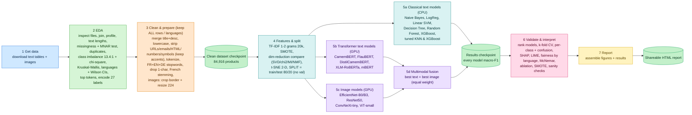

```mermaid
flowchart LR
    classDef p0 fill:#cfe8ff,stroke:#1e6fd9,color:#0a2a4a;
    classDef eda fill:#d6f5d6,stroke:#2e9e2e,color:#0a3a0a;
    classDef prep fill:#ffe6cc,stroke:#e07b00,color:#5a2e00;
    classDef cpu fill:#d9f2f2,stroke:#1b8a8a,color:#053535;
    classDef gpu fill:#ece0ff,stroke:#7a3fd0,color:#2e0a5a;
    classDef valid fill:#ffd9e8,stroke:#d6336c,color:#5a0a2a;
    classDef rep fill:#fff3bf,stroke:#d9a200,color:#5a4500;
    classDef ckpt fill:#c3f0ca,stroke:#0f9d58,color:#063a1e;

    A["1 Get data<br/>download text tables + images"]:::p0
    B["2 EDA<br/>inspect files, join, profile, text lengths,<br/>missingness + MNAR test, duplicates,<br/>class imbalance 13.4:1 + chi-square,<br/>Kruskal-Wallis, languages + Wilson CIs,<br/>top tokens, encode 27 labels"]:::eda
    C["3 Clean & prepare (keep ALL rows / languages)<br/>merge title+desc, lowercase, strip URLs/emails/HTML/<br/>numbers/symbols (keep accents), tokenize,<br/>FR+EN+DE stopwords, drop 1-char, French stemming,<br/>images: crop border + resize 224"]:::prep
    D[("Clean dataset checkpoint<br/>84,916 products")]:::ckpt
    E["4 Features & split<br/>TF-IDF 1-2 grams 20k, SMOTE,<br/>dim-reduction compare (SVD/chi2/MI/NMF),<br/>t-SNE 2-D, SPLIT = train/test 80/20 (no val)"]:::cpu
    F1["5a Classical text models (CPU)<br/>Naive Bayes, LogReg, Linear SVM,<br/>Decision Tree, Random Forest, XGBoost,<br/>tuned KNN & XGBoost"]:::cpu
    F2["5b Transformer text models (GPU)<br/>CamemBERT, FlauBERT, DistilCamemBERT,<br/>XLM-RoBERTa, mBERT"]:::gpu
    F3["5c Image models (GPU)<br/>EfficientNet-B0/B3, ResNet50,<br/>ConvNeXt-tiny, ViT-small"]:::gpu
    F4["5d Multimodal fusion<br/>best text + best image (equal weight)"]:::gpu
    G[("Results checkpoint<br/>every model macro-F1")]:::ckpt
    H["6 Validate & interpret<br/>rank models, k-fold CV, per-class + confusion,<br/>SHAP, LIME, fairness by language, McNemar,<br/>ablation, SMOTE, sanity checks"]:::valid
    I["7 Report<br/>assemble figures + results"]:::rep
    J[("Shareable HTML report")]:::ckpt

    A --> B --> C --> D --> E
    E --> F1
    E --> F2
    E --> F3
    F1 --> G
    F2 --> F4
    F3 --> F4
    F4 --> G
    G --> H --> I --> J
```
